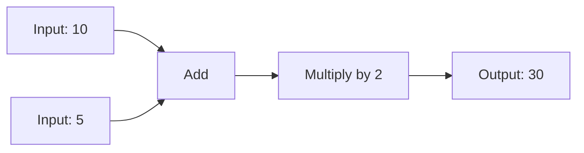

## Installation

<CodeGroup>
```bash npm
npm install @LyntFlow/core
```

```bash pnpm
pnpm add @LyntFlow/core
```

```bash yarn
yarn add @LyntFlow/core
```
</CodeGroup>

## Your First Flow

Let's build a simple calculator that adds two numbers and multiplies the result.

<Steps>
  <Step title="Import the Engine">
    ```typescript
    import { FlowEngine } from '@LyntFlow/core';
    ```
  </Step>

  <Step title="Define Your Flow">
    ```json
    const flow = {
      "nodes": [
        {
          "id": "input1",
          "type": "input",
          "data": { "value": 10 }
        },
        {
          "id": "input2",
          "type": "input",
          "data": { "value": 5 }
        },
        {
          "id": "add",
          "type": "add"
        },
        {
          "id": "multiply",
          "type": "multiply",
          "data": { "b": 2 }
        },
        {
          "id": "output",
          "type": "output"
        }
      ],
      "connections": [
        { "from": "input1", "to": "add", "handle": "a" },
        { "from": "input2", "to": "add", "handle": "b" },
        { "from": "add", "to": "multiply", "handle": "a" },
        { "from": "multiply", "to": "output" }
      ]
    };
    ```
  </Step>

  <Step title="Execute">
    ```typescript
    const engine = new FlowEngine();
    const result = await engine.execute(flow);

    console.log(result); // Output: 30
    // (10 + 5) * 2 = 30
    ```
  </Step>
</Steps>

## Understanding the Flow

The flow above demonstrates:

1. **Input Nodes**: Provide initial data values
2. **Operation Nodes**: Process data (`add`, `multiply`)
3. **Connections**: Link nodes together to pass data
4. **Output Node**: Collect the final result

<Frame>

</Frame>

## Common Patterns

<AccordionGroup>
  <Accordion title="Conditional Logic" icon="code-branch">
    Use the `if` node to create conditional flows:

    ```json
    {
      "type": "if",
      "data": {
        "condition": "value > 10"
      }
    }
    ```
  </Accordion>

  <Accordion title="Array Processing" icon="list">
    Process arrays with `map`, `filter`, and `reduce`:

    ```json
    {
      "type": "array-map",
      "data": {
        "operation": "multiply",
        "value": 2
      }
    }
    ```
  </Accordion>

  <Accordion title="Data Transformation" icon="wand-magic-sparkles">
    Transform objects with `object-get` and `object-set`:

    ```json
    {
      "type": "object-get",
      "data": {
        "path": "user.name"
      }
    }
    ```
  </Accordion>
</AccordionGroup>

## Next Steps

<CardGroup cols={2}>
  <Card title="Explore Nodes" icon="cubes" href="/nodes/data-input">
    Browse all 37+ available nodes
  </Card>

  <Card title="Learn Patterns" icon="lightbulb" href="/introduction">
    Discover common workflow patterns
  </Card>
</CardGroup>

<Tip>
  **Pro Tip**: Use the `console` node during development to debug your flows and inspect data at any point!
</Tip>
